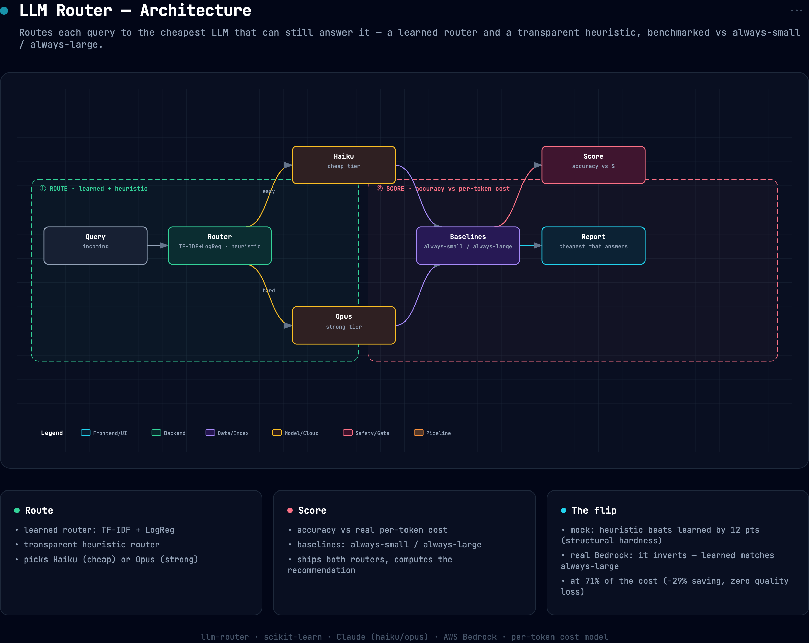

# llm-router

Most production LLM traffic is *easy*, greetings, lookups, formatting, yet teams pay
top-model prices for every token. **llm-router** sends each query to the cheapest model that
can still answer it correctly, and **measures** the cost/quality tradeoff against two
baselines instead of asserting it.

```bash
llm-router --mock                 # offline, deterministic (reproduces the numbers below)
llm-router --provider bedrock     # real Claude on AWS Bedrock (creds from .env)
llm-router                        # auto: Bedrock if AWS creds, else Anthropic API, else mock
llm-router --json
```


## Architecture



*Interactive/exportable version: [`docs/assets/architecture.html`](docs/assets/architecture.html).*

## How it works

1. **Difficulty labels.** A query set tagged `easy` / `hard`, where `hard` means a cheap
   model gets it wrong and you actually need the large one. This is what makes routing
   *measurable*.
2. **Two routers.**
   - `heuristic`, transparent, no training: long prompt or code/math/reasoning cues → large.
   - `learned`. TF-IDF + logistic regression predicts `P(hard)` and routes on a threshold.
3. **Benchmark.** Run `always-small`, `always-large`, and both routers over the same held-out
   queries; report accuracy, total cost (real per-token pricing), and **cost saved vs
   always-large at matched quality**.

## Measured results

`llm-router --mock` on 24 held-out queries (cost model: $0.80/1M small "haiku-class" vs
$15/1M large "opus-class"):

| strategy | accuracy | cost ($) | % → large | cost vs always-large |
|---|---|---|---|---|
| always-small | 0.500 | 0.00258 | 0% | 5% of cost |
| always-large | 1.000 | 0.04839 | 100% |, |
| **heuristic router** | **0.958** | **0.02492** | 46% | **51% of cost (−49%)** |
| learned router | 0.833 | 0.02368 | 46% | 49% of cost (−51%) |

**Recommended: the heuristic router, 96% of always-large quality at 51% of the cost.**

### The honest finding: structure beats vocabulary

The learned TF-IDF router and the heuristic route the *same fraction* to the large model
(46%) and cost the same, but the heuristic is **+12 points more accurate** (95.8% vs 83.3%).
Why: difficulty here is **structural** (length, presence of code/math/multi-step reasoning),
not **lexical**. TF-IDF keys on words, so a held-out hard query phrased with unseen vocabulary
slips through to the small model. Pushing the learned router's threshold down to catch those
recovers quality but erases the savings (at threshold 0.30 it routes everything to large).

The transparent length+keyword heuristic generalizes because it keys on the thing that
actually makes a query hard. The learned router is kept in the benchmark precisely to show
this, a clean reminder that the fancier model isn't automatically the better router.

## Validated on real AWS Bedrock

The mock numbers above are deterministic so CI and reviewers reproduce them for free. To
confirm the routing actually pays off against *real* models, the same benchmark was run end to
end on **AWS Bedrock**, small = `claude-haiku-4-5`, large = `claude-opus-4-6`, every answer
graded by Opus as judge, cost from real token usage (`llm-router --provider bedrock`, 24
held-out queries, **total spend ≈ $0.22**):

| strategy | accuracy | cost ($) | % → large | cost vs always-large |
|---|---|---|---|---|
| always-small | 0.833 | 0.00426 | 0% | 5% of cost |
| always-large | 0.917 | 0.08205 | 100% |, |
| heuristic router | 0.875 | 0.07100 | 46% | 87% of cost (−13%) |
| **learned router** | **0.917** | **0.05802** | 46% | **71% of cost (−29%)** |

**On real Bedrock the learned router matches always-large quality (0.917) at 71% of the cost, a
29% saving for zero quality loss.** Two honest differences from the mock run, both expected:

- **Real Haiku is far more capable than the mock's worst case.** always-small scores **0.833**,
  not 0.5, a cheap model genuinely answers most queries, which is *why* routing (not
  always-large) is the right default. The mock deliberately models a weaker small model to make
  the routing logic measurable; real models shrink the gap but the ranking holds.
- **Which router wins flips between mock and real.** The heuristic wins on the synthetic labels
  (structure-only signal); the learned router wins on Bedrock (it adapts to where real Haiku
  actually fails). The benchmark ships both and lets the data pick, `recommended` is computed,
  not hard-coded.

## Backends

`get_provider()` auto-selects: **AWS Bedrock** if AWS creds are present (the repo convention, 
`AnthropicBedrock`, `global.anthropic.*` inference-profile IDs, creds from `.env`), else the
**first-party Anthropic API** if `ANTHROPIC_API_KEY` is set, else the **deterministic mock**.
Force one with `--provider {mock,bedrock,anthropic}` or `LLM_ROUTER_PROVIDER`. Copy
`.env.example` → `.env` for the Bedrock path (`.env` is gitignored). Mock needs no keys, so CI
and reviewers reproduce every mock number at zero cost.

## Install & test

```bash
pip install -e ".[dev]"             # mock path
pip install -e ".[dev,bedrock]"     # + AWS Bedrock backend (anthropic[bedrock], python-dotenv)
pytest -q                           # 7 passed (mock provider — no network)
```

## Stack

scikit-learn (TF-IDF + logistic regression), pure-Python heuristic router, AWS Bedrock via the
`anthropic[bedrock]` SDK / first-party Anthropic SDK (optional), real per-token cost model.

## License

MIT
